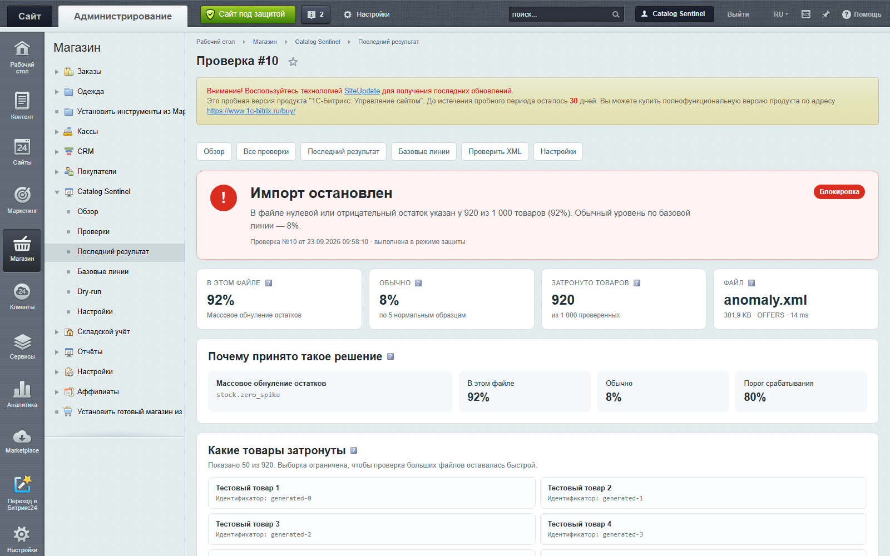
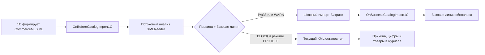
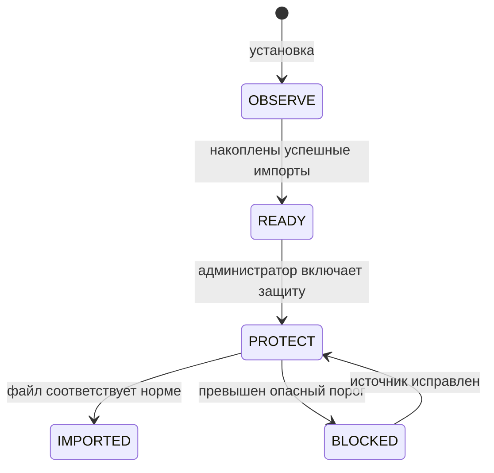
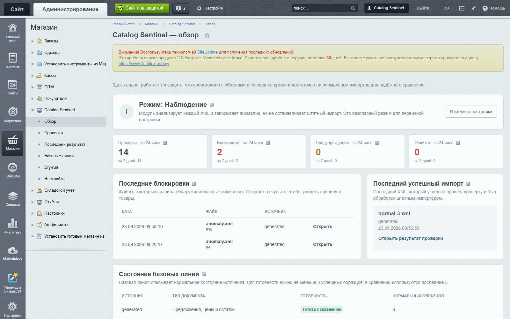
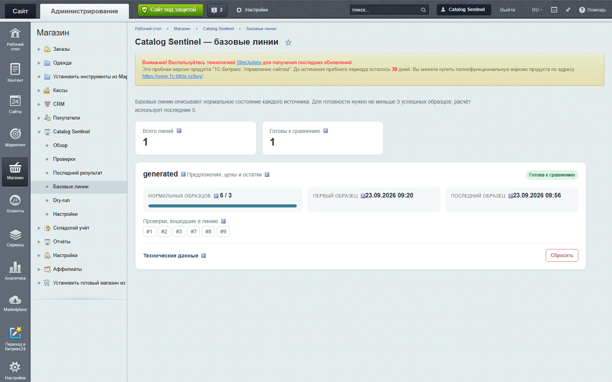
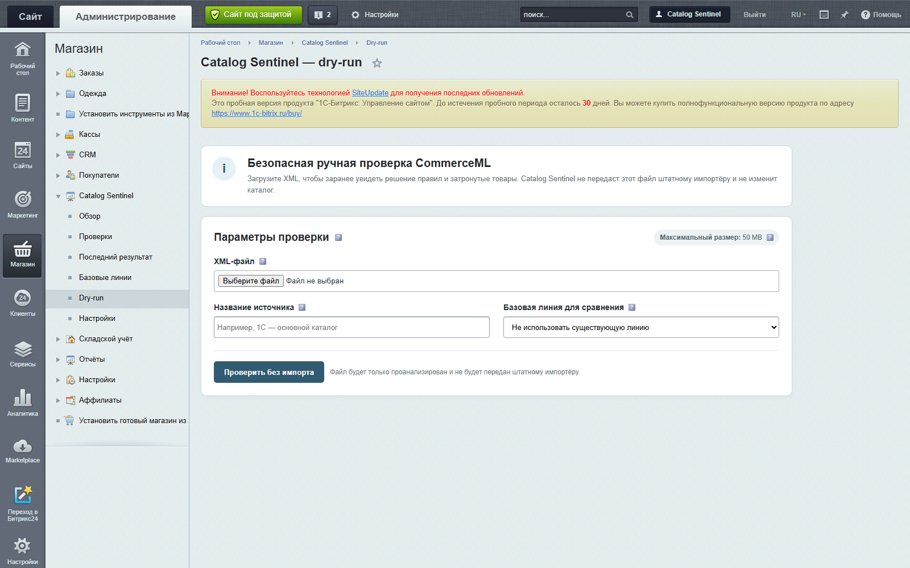

<div align="center">

# 🛡️ Catalog Sentinel

### Защита каталога «1С-Битрикс» от опасных CommerceML-выгрузок

**Находит массовое обнуление остатков и цен до штатного импорта, объясняет риск цифрами и останавливает только проблемный XML-файл.**

[](https://www.php.net/)
[](https://www.1c-bitrix.ru/)
[](#что-проверяет-catalog-sentinel)
[](#проверено-на-реальном-битрикс)
[](LICENSE)

[Почему это важно](#одна-неудачная-выгрузка-может-испортить-весь-каталог) · [Как работает](#как-catalog-sentinel-защищает-импорт) · [Интерфейс](#всё-нужное-видно-в-административной-панели) · [Установка](#быстрый-старт) · [Безопасность](#приватность-и-безопасность)

</div>



> На демонстрационном сценарии модуль увидел нулевой или отрицательный остаток у **920 из 1 000 товаров (92%)** при обычном уровне **8%** и остановил файл до передачи штатному импортёру.

## Одна неудачная выгрузка может испортить весь каталог

Интеграция с 1С обычно работает незаметно — пока повреждённый или неполный XML не заменит корректные данные магазина. Последствия обнаруживаются уже после импорта:

- сотни товаров внезапно становятся недоступными;
- цены превращаются в нули;
- свойства очищаются массово;
- витрина теряет продажи, а команда вручную ищет причину;
- простой откат оказывается невозможным или слишком дорогим.

Catalog Sentinel ставит **контрольную точку перед импортом**. Он анализирует текущий CommerceML-файл потоково, сравнивает его с нормальным поведением конкретного источника и принимает объяснимое решение: пропустить, предупредить или остановить файл.

| Без Catalog Sentinel | С Catalog Sentinel |
|---|---|
| Ошибка становится заметна после изменения каталога | Аномалия обнаруживается до штатного импорта |
| Администратор видит только последствия | Видны правило, измерения, пороги и затронутые товары |
| Один порог приходится подбирать для всех обменов | Базовая линия строится отдельно по источнику и типу документа |
| Большой XML приходится загружать в память | `XMLReader` обрабатывает файл потоком |
| Для проверки нужен рискованный тестовый импорт | Dry-run анализирует XML без изменения каталога |

## Как Catalog Sentinel защищает импорт



### Решение не является «чёрным ящиком»

Для каждой блокировки сохраняются:

1. код сработавшего правила;
2. фактические измерения файла;
3. обычные значения по базовой линии;
4. настроенные пороги;
5. ограниченная выборка ID и названий товаров;
6. понятное объяснение и рекомендуемые действия.

Если нужен весь перечень, администратор повторно выбирает исходный XML и получает **потоковый CSV-отчёт**. Полный список и сам XML не сохраняются в базе.

## Безопасное включение защиты



- **OBSERVE** — анализирует обмен и собирает историю, но ничего не блокирует.
- **READY** — для источника сформирована надёжная базовая линия.
- **PROTECT** — опасный файл останавливается до штатного импорта.

Правила, которым нужна история, не блокируют обмен, пока базовая линия не готова или не подтверждена администратором.

## Всё нужное видно в административной панели

Интерфейс встроен в раздел «Магазин» и использует привычные права, CSRF-защиту и компоненты административной части Битрикс. На каждом экране есть контекстные подсказки.

| Контроль обменов | Обучение на нормальных импортах |
|---|---|
|  |  |
| За один взгляд: режим, проверки, блокировки, последний успешный импорт. | Прогресс обучения, источник, тип документа и проверки, вошедшие в baseline. |

### Проверка XML без импорта



Dry-run позволяет загрузить XML вручную, выбрать источник и базовую линию, увидеть решение правил — и **не передаёт файл штатному импортёру**.

## Что проверяет Catalog Sentinel

| Риск | Правило | Поведение по умолчанию |
|---|---|---|
| Повреждённый XML или `DOCTYPE` | `xml.well_formed` | Блокировать |
| Неизвестная структура CommerceML | `document.supported` | Предупредить |
| Резкое падение числа товаров | `document.item_count_drop` | Блокировать после готовности baseline |
| Массовые нулевые/отрицательные остатки | `stock.zero_spike` | Блокировать после готовности baseline |
| Массовые нулевые/отрицательные цены | `price.zero_spike` | Блокировать после готовности baseline |
| Явная массовая очистка выбранных свойств | `property.empty_spike` | Настраивается, изначально выключено |
| Товары без внешнего ID | `identifier.missing_ratio` | Предупредить |
| Резкое уменьшение размера файла | `file.size_drop` | Предупредить после готовности baseline |

Отсутствующий XML-тег **не считается нулём или очисткой**. Анализируются только явно переданные значения.

## Почему модуль подходит для больших каталогов

- потоковый `XMLReader` вместо загрузки всего документа в память;
- в базе остаются агрегаты и ограниченная выборка товаров, а не полный XML;
- базовые линии считаются медианой последних успешных импортов;
- решения повторно используются в пределах настраиваемого кэша;
- нет runtime-зависимостей вне Битрикс и стандартных расширений PHP.

Измерения локального стенда с PHP 8.4.14 и `memory_limit=256M`:

| Объём | Размер XML | Время анализа | Peak memory |
|---:|---:|---:|---:|
| 10 000 предложений | 2,27 МБ | 145 мс | 2 МБ |
| 250 000 предложений | 57,1 МБ | 4,15 с | 2 МБ |

> Абсолютное время зависит от сервера. Эти цифры — фактический локальный performance-тест, а не обещание для любого окружения.

## Быстрый старт

### Требования

- PHP 8.1+;
- `ext-xml` с `XMLReader`;
- «1С-Битрикс: Управление сайтом» с D7 ORM;
- модули `main`, `iblock`, `catalog`;
- поддерживаемая установленным Битрикс версия MySQL/MariaDB.

### Установка

1. Скачайте репозиторий через **Code → Download ZIP**.
2. Поместите содержимое в `/local/modules/gorshkov.catalogsentinel`.
3. В административной части Битрикс откройте «Marketplace → Установленные решения» и установите **Catalog Sentinel**.
4. Проверьте раздел «Catalog Sentinel → Настройки → Диагностика».
5. Оставьте режим **Наблюдение** минимум на три нормальных обмена каждого источника и типа документа.
6. Убедитесь, что базовая линия готова, выполните dry-run тестового файла и только затем включите **Защиту**.

Установщик создаёт только собственные таблицы `b_gcs_*`, административные прокси, два обработчика событий, агент очистки и локальное почтовое событие.

## Приватность и безопасность

Catalog Sentinel работает **полностью на вашем сервере**:

- не отправляет XML, статистику или ошибки наружу;
- не использует внешние API, ИИ, телеметрию или удалённую лицензию;
- запрещает сетевые обращения XML-парсера, DTD и подстановку сущностей;
- не сохраняет полный XML или абсолютный путь к нему;
- защищает административные POST-действия правами Битрикс и `bitrix_sessid`;
- экранирует HTML и нейтрализует CSV formula injection;
- выключает уведомления по умолчанию и ограничивает их cooldown-периодом.

## Проверено на реальном Битрикс

Platform smoke выполнен на отдельной локальной DEMO-VM:

- «1С-Битрикс: Управление сайтом» `main 26.150.0`;
- `iblock 25.300.0`, `catalog 25.550.0`;
- PHP 8.2.30;
- MySQL/Percona-compatible 8.0.44-35;
- установка, повторная установка и оба варианта удаления;
- реальные `OnBeforeCatalogImport1C` и `OnSuccessCatalogImport1C`;
- авторизованный dry-run, JSON/CSV export и все административные страницы;
- **69 автоматических тестов, 193 проверки**, PHPStan и PHPCS.

Контрольный магазин после lifecycle-тестов сохранил все **316 элементов инфоблоков** и **313 товарных записей**.

## Важная граница ответственности

Catalog Sentinel защищает **текущий XML-файл до его импорта**. Он не заявляет транзакционный откат всей многофайловой сессии обмена и не перехватывает нестандартные интеграции, которые обходят штатные события Битрикс.

## Разработка

```bash
composer install
composer qa
composer test:performance
php tools/build-release.php
php tools/validate-release.php
```

Runtime-код не загружает Composer autoloader и не зависит от `vendor`.

## Лицензия

[MIT](LICENSE) — можно использовать, изучать и дорабатывать решение в собственных проектах.

---

<div align="center">

**Catalog Sentinel превращает импорт из потенциальной точки отказа в контролируемый и объяснимый процесс.**

[⬆ Вернуться к началу](#catalog-sentinel)

</div>
